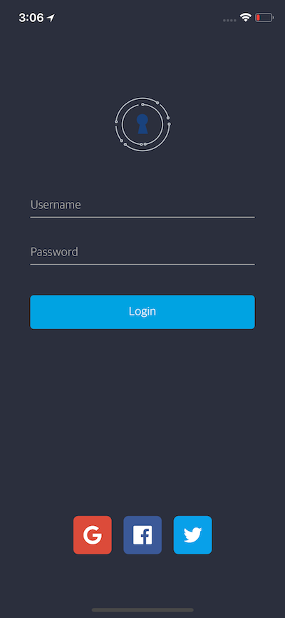

# Authenticator

Authenticator is a robust and easy-to-use iOS framework for implementing social network authentication. This library allows for quickly adding login support for Facebook, Twitter, or Google, and automatically persists user sessions across app launches.



## Getting Started
1. Register your application via the developer portal for desired websites.
    - [Google](console.cloud.google.com)
    - [Facebook](https://developers.facebook.com/apps)
    - [Twitter](https://developer.twitter.com/) (requires access approval)    
        - Set the Callback URL to `twitterkit-YOUR_CONSUMER_KEY://`


2. Add **Authenticator** to your project.
    - Copy the files in the Authenticator directory into your project
    - Copy the facebook, google, and twitter image assets into your Assets.xcassets
    - Install the [dependencies](#Dependencies) for Authenticator using CocoaPods


3. Configure **Info.plist** with the following XML. The steps are also outlined in the linked documentation for each website.
    - [Google](https://developers.google.com/identity/sign-in/ios/start-integrating)
        ```xml
        <key>CFBundleURLTypes</key>
        <array>
          <dict>
            <key>CFBundleTypeRole</key>
            <string>Editor</string>
            <key>CFBundleURLSchemes</key>
            <array>
              <string>YOUR_CLIENT_ID_REVERSED</string>
            </array>
          </dict>
        </array>
        ```
    - [Facebook](https://developers.facebook.com/docs/facebook-login/ios/)
        ```xml
        <key>CFBundleURLTypes</key>
        <array>
          <dict>
            <key>CFBundleURLSchemes</key>
            <array>
              <string>fbYOUR_APP_ID</string>
            </array>
          </dict>
        </array>
        <key>LSApplicationQueriesSchemes</key>
        <array>
          <string>fbauth2</string>
        </array>
        <key>FacebookAppID</key>
        <string>YOUR_APP_ID</string>
        <key>FacebookDisplayName</key>
        <string>YOUR_DISPLAY_NAME</string>
        ```
    - [Twitter](https://github.com/twitter/twitter-kit-ios/wiki/Installation)
        ```xml
        <key>CFBundleURLTypes</key>
        <array>
          <dict>
            <key>CFBundleURLSchemes</key>
            <array>
              <string>twitterkit-YOUR_CONSUMER_KEY</string>
            </array>
          </dict>
        </array>
        <key>LSApplicationQueriesSchemes</key>
        <array>
          <string>twitter</string>
          <string>twitterAuth</string>
        </array>
        ```


4. Update **AppDelegate.swift** with the following configuration code.
      ```swift
      func application(_ application: UIApplication, didFinishLaunchingWithOptions launchOptions: [UIApplicationLaunchOptionsKey: Any]?) -> Bool {
          // Initialize login services
          Authenticator.shared.configFacebook(application, didFinishLaunchingWithOptions: launchOptions)
          Authenticator.shared.configGoogle(clientID: "GOOGLE_CLIENT_ID")
          Authenticator.shared.configTwitter(consumerKey: "TWITTER_CONSUMER_KEY", consumerSecret: "TWITTER_CONSUMER_SECRET")

          return true
      }

      func applicationWillResignActive(_ application: UIApplication) {
          Authenticator.shared.applicationWillResignActive(application)
      }

      func application(_ app: UIApplication, open url: URL, options: [UIApplicationOpenURLOptionsKey : Any] = [:]) -> Bool {
          return Authenticator.shared.application(app, open: url, options: options)
      }
      ```

5. Implement `AuthenticatorDelegate` in the ViewController designated for login.
      ```swift
      override func viewDidLoad() {
        super.viewDidLoad()
        Authenticator.shared.delegate = self
        Authenticator.shared.logInSilently() // Automatically log in previously authenticated user
      }

      func authenticator(_ authenticator: Authenticator, didLogInFor user: User?, withError error: Error?) {
        guard let user = user else {
          if let error = error {
            // Handle error
          }
          return
        }
        // Login successful
      }

      func authenticator(_ authenticator: Authenticator, didLogOutFor user: User?, withError error: Error?) {
        // Handle logout  
      }
      ```

6. Add sign in options to user interface
    - Using `LoginButton`
        ```swift
        let socialLogin = LoginButtonGroup(types: [.google, .facebook, .twitter])

        // Add to view and set up constraints
        view.addSubview(socialLogin)
        socialLogin.centerXAnchor.constraint(equalTo: view.safeAreaLayoutGuide.centerXAnchor).isActive = true
        socialLogin.centerYAnchor.constraint(equalTo: view.safeAreaLayoutGuide.centerYAnchor).isActive = true
        ```

    - Using a custom button
        ```swift
        var myButton: MyCustomButton!

        myButton.addTarget()
        myButton.addTarget(self, action: #selector(loginWithFacebook), for: .touchUpInside)

        @objc func loginWithFacebook() {
          Authenticator.shared.logIn(with: .facebook)
        }
        ```

## Dependencies
### Authenticator
- FacebookLogin
- FacebookCore
- GoogleSignIn
- TwitterKit

### Demo Project
- [Kingfisher](https://github.com/onevcat/Kingfisher)
- [NVActivityIndicatorView](https://github.com/ninjaprox/NVActivityIndicatorView)
- [Material](https://github.com/CosmicMind/Material)
